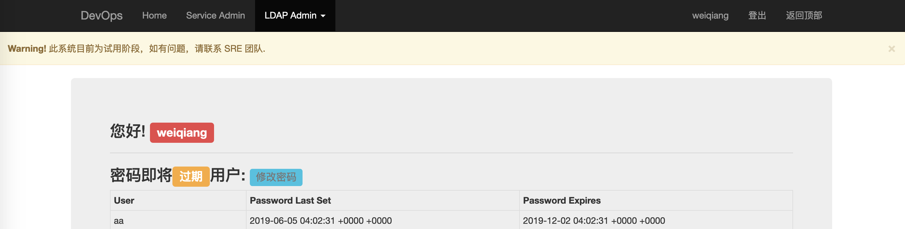

# devops
devops 集成众多自动化运维工具

### Authentication
- 使用 LDAP 用户密码进行认证
- 使用 LDAP 安全组授权功能模块
- 使用 Google Authenticator 进行二次验证

### User Management
url: /users
- 创建/查看/重置 Google Authenticator 的二次验证码

### Service Management
url: /service
- 查看 server
- 查看 service
- Service action management: status、start、stop、restart

### LDAP Management
url: /ldapAdmin/
- 密码过期用户提示
- 密码修改
- 遗忘密码
